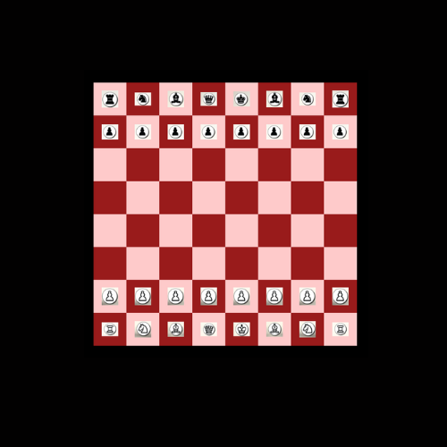

# REACT CHESS GAME

This project was developed within the framework of the Christmas Coding Challenge 2023, organized by Who Women Code London. Dive into the world of React Chess Game,  a digital battleground where strategic moves meet online competition. Challenge friends or make new opponents worldwide, and let the games begin!

Chess Game is a classic strategy game played between two players. The objective of the game is to checkmate the opponent's king.

- When it's your turn, move your pieces. Movement rules vary depending on the type of piece.
- Checkmate occurs when the opponent's king is under threat, and there is no escape route. To win the game, you must checkmate the opponent's king.
- During the game, be mindful of checkmate, check, and draw situations. For more information about the rules, please consult the official chess rules.



## Features

- **Drag and Drop Chess Pieces:** Enjoy a seamless chess-playing experience with the intuitive drag-and-drop feature for moving chess pieces.
- **Determine the Winning Team:** The game automatically identifies the winning team and announces the victorious side.
- **Congratulations Message:** Celebrate success! A congratulatory message is displayed for the winning team, adding a delightful touch to the gaming experience.

## Used Technologies:

- React
- React DnD (Drag and Drop)
- RxJS
- Chessboard.js
- HTML5
- Chess.js

## Getting Started

1. Clone the repository:

   ```
   git clone https://github.com/arzucaner/react-chess-game
   ```
2. Install dependencies:

   ```
   npm install
   ```
3. Run the application:

   ```
   npm install
   ```
4. Open [http://localhost:3000](http://localhost:3000/) in your browser.

## Contributing

Feel free to contribute to the project. Just fork the repository, make your changes, and submit a pull request!

## License

This project is licensed under the MIT.
